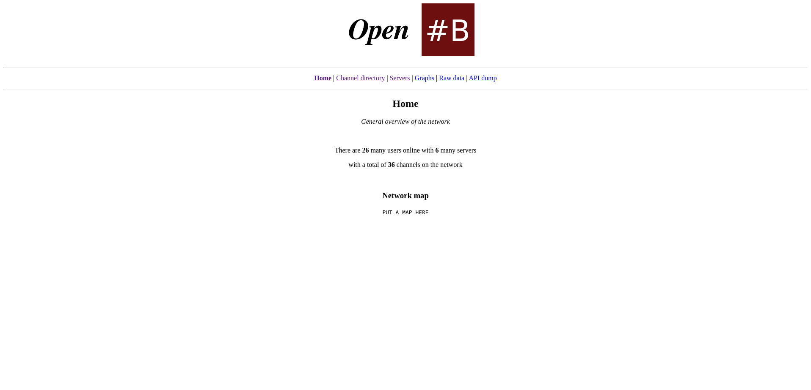
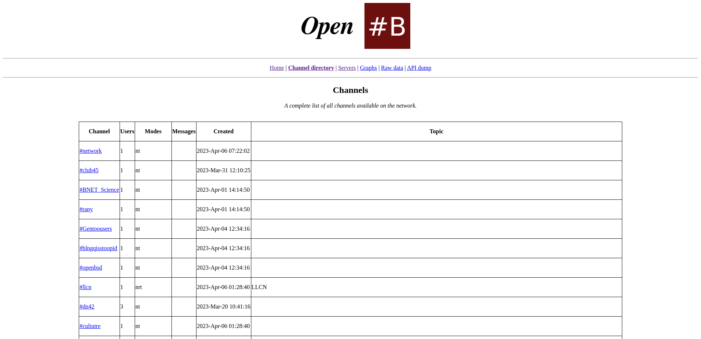
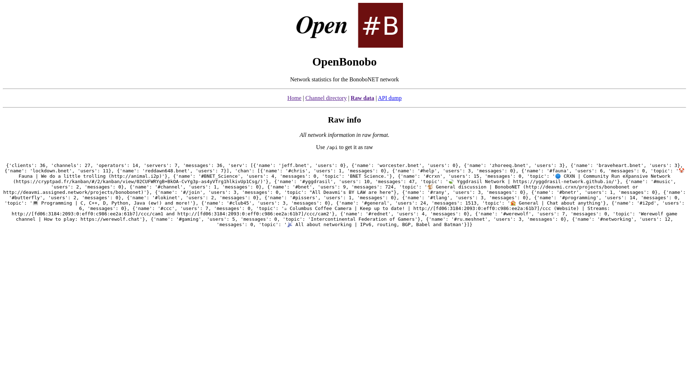

<center>


 
# OpenBNET

Lightweight web interface and API endpoint for the `third/wwwstats` unrealircd module.

</center>

---

## Screenshots

### Home

Available at `/`:



### Channels directory

Available at `/channe;s`:



### Raw output

Available at `/raw`:



### API endpoint

Available at `/api`:


## Setting up

You will need the following and can install them easily:

1. `python3`
2. `flask`
3. `pip`

```
apt install python3 python3-pip
pip3 install flask
```

You will need to configure the `third/wwwstats` module as well, information on doing so can be found [here](http://deavmi.assigned.network/projects/bonobonet/openbnet/).

## Usage

Firstly grab all the files in this repository, then:

```
chmod +x obnet.py
```

The next thing to do will be to set the following environment variables:

* `OPENBNET_BIND_ADDR`
  *  The addresses to listen on (for the web server)
* `OPENBNET_BIND_PORT`
  * The port to listen on (for the web server)
* `UNREAL_SOCKET_PATH`
  * This is the path to the unrealircd `third/wwwstats` UNIX domain socket

You can then run it like such:

```
OPENBNET_BIND_ADDR="::" OPENBNET_BIND_PORT=8081 UNREAL_SOCKET_PATH=/tmp/openbnet.sock ./obnet.py
```

### Systemd-unit

There is an example systemd unit file included in the repository as `openbnet.service`

## Custom branding

You can adjust the branding in `obnet.py` by taking a look at the following:

```python
# Network information
NET_INFO = {
    "networkName": "OpenBonobo",
    "description": "Network statistics for the BonoboNET network",
    "networkLogo": "open_bnet_banner.png",
}
```

## License

This project uses the [AGPL version 3](https://www.gnu.org/licenses/agpl-3.0.en.html) license.

## Credits

* [`deavmi`](https://github.com/deavmi)
* [`rany2`](http://github.com/rany2)
